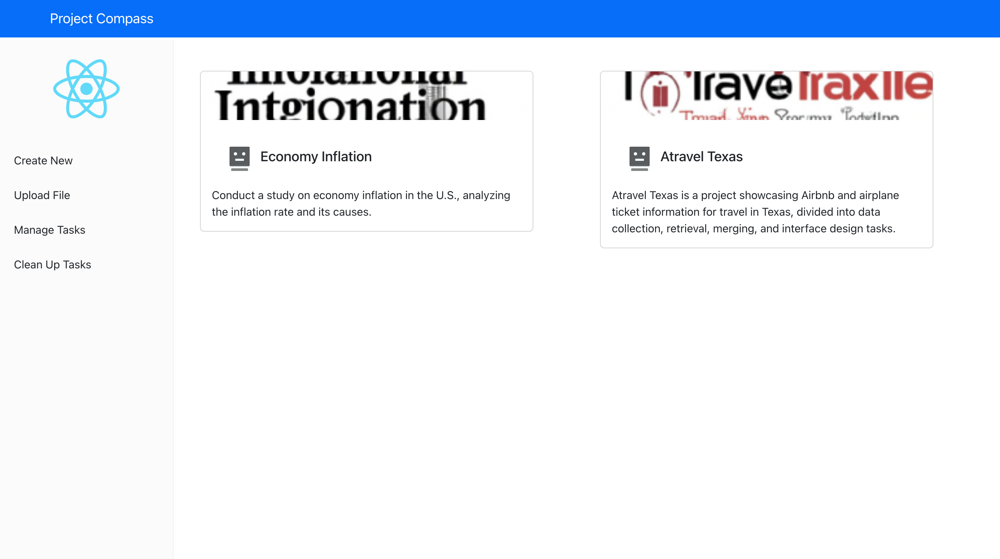
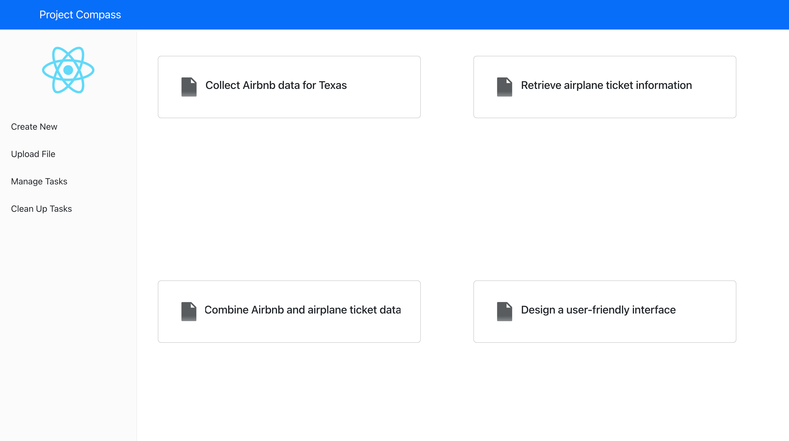
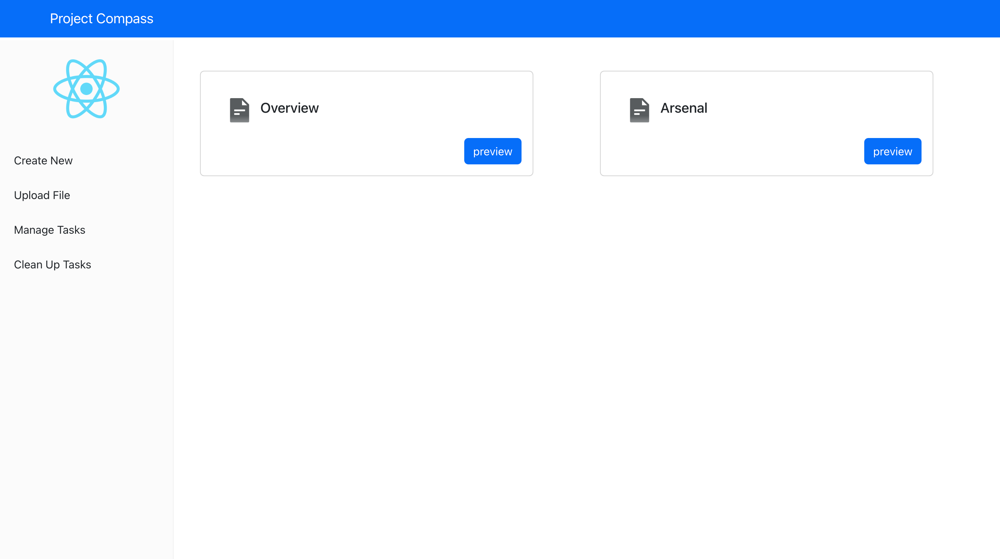

# Project Compass

A chatbot-driven tool for generating structured guides for academic assignments.

## Introduction

AI chatbots can enhance productivity by offering detailed and personalized responses compared to traditional search engines. However, their powerful capabilities can also be misused, especially in educational settings where students may be tempted to seek direct answers to their assignments.

**Project Compass aims to tackle this issue**. It leverages the capabilities of ChatGPT to guide students through the process of completing projects. Rather than providing direct answers, our chatbot breaks down assignments into manageable steps, offering detailed explanations and resource suggestions for each part.

## Table of Contents

- [Introduction](#introduction)
- [Features](#features)
- [Upcoming Features](#upcoming-features)
- [Installation](#installation)
- [Usage](#usage)
- [Screenshots](#screenshots)
- [Credits](#credits)
- [Contact](#contact)

## Features

- Generate structured project guides from user-supplied descriptions
- Built-in cloud drive for easy file uploads and downloads
- Real-time preview system

## Upcoming Features

- Restricted-behavior built-in chatbot for focused guidance

## Installation

```bash
# Install prerequisites
Install Node.js, npm, and Redis from (https://redis.io/docs/getting-started/installation/install-redis-on-mac-os/)

# Clone the GitLab repository
git clone https://gitlab.com/BWN133/cloud_todo.git

# Set up the environment
Navigate to /backend and create a .env file with the following:
MONGO_CONNECTION_STRING=<MongoDB_Connection_String>
PORT=<Your_Choice_Of_Port>
SESSION_SECRET=<Random_Hash>
OPENAI_API_KEY=<OpenAI_API_Key>
DEFAULT_PARENT_ID=6348acd2e1a47ca32e79f46f

# Install dependencies
Run 'npm install' in both /frontend and /backend directories

# Start the application
Start the Redis client, then run 'npm start' in both /frontend and /backend directories.
```
## Screenshots





## Credits

### Main Contributors

- [Bowen Yang](https://www.linkedin.com/in/bowen-yang133) - Project Leader, Full-Stack Frameworker, Backend Optimization
- [Yuzhuo Bai](https://www.linkedin.com/in/yuzhuo-bai-0740491ab/) - Redis Cache, Frontend optimization
- [lingyang Kong](https://www.linkedin.com/in/lingyang-kong-52326b1b0/) - Prompt Engineering, AI Related Functions


### Inspirational Projects

- [instagram-mern](https://github.com/jigar-sable/instagram-mern)
- [mern-reminder](https://github.com/codinginflow/MERN-course)
- [Influential-MERN-Tutorial](https://www.youtube.com/watch?v=FcxjCPeicvU&t=11513s)


## Contact
Bowen Yang
Email: by2365@columbia.edu